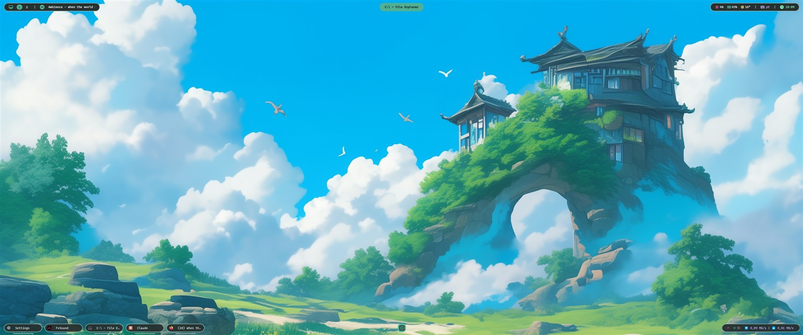
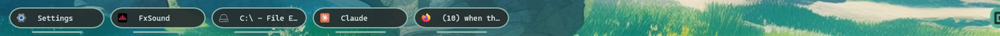
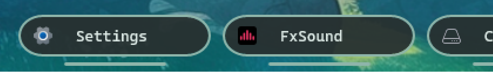
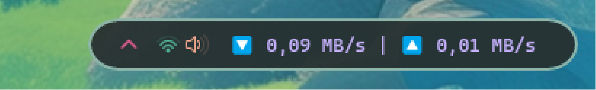
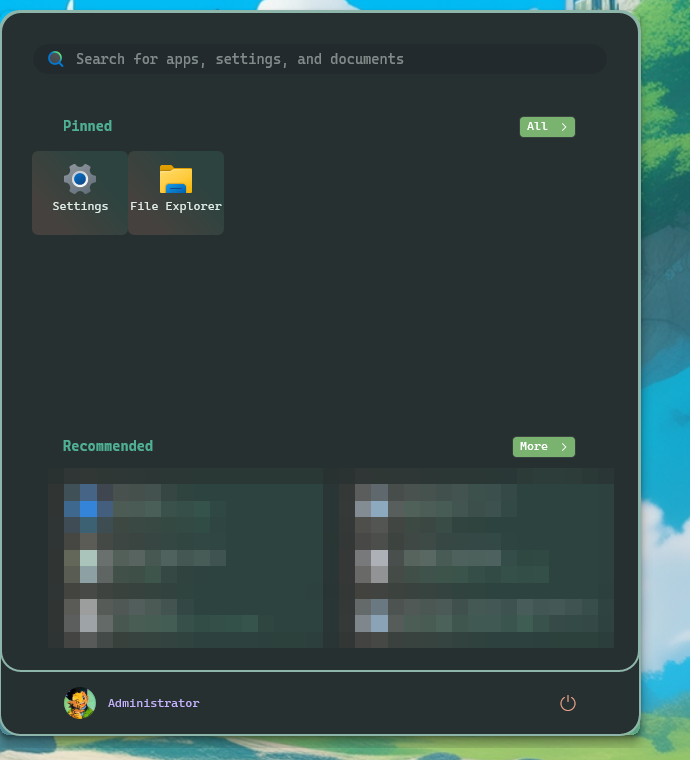
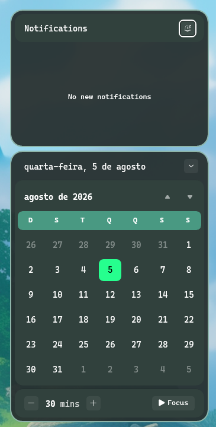
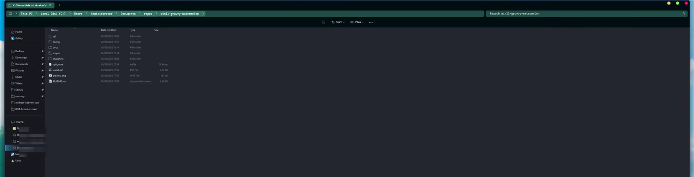

# win11-gruvvy-watermelon

Windows 11 shell dressed in the [gruvvy-watermelon](https://github.com/zacccharv/zebar-gruvvy-watermelon)
palette: Zebar on top, taskbar below it, and the start menu / notification
center / file explorer in the same colors and the same font.

## Screenshots

Full desktop — Zebar on top, taskbar at the bottom, wallpaper in between:



The two bars, side by side. Same palette, same 36px pills, same 13px Cascadia
Mono, same 16px icons — the taskbar is matched to the bar, not the other way
around:




Taskbar pieces, 3× — window labels (`taskbar-labels` + the styler), the start
chip that replaces the Windows logo, and the tray with its per-icon colors and
the network line from `taskbar-clock-customization`:





Start menu and notification center, both from their styler mods:




File explorer — title bar, tabs, breadcrumb and toolbar are themed; the file
list and nav pane are DirectUI and stay as Windows draws them:



Mosaicked regions are recent-file names and network share addresses, not part
of the theme.

Everything here is scripts that write settings — no forked mods, no patched
binaries checked in. The only file that gets modified in place is the Zebar
pack's compiled bundle, and that one keeps a `.orig` next to it.

| piece | what carries the theme |
|---|---|
| Zebar bar | `scripts/zebar-gruvvy-patch.ps1` patches the installed pack's bundle |
| taskbar | `scripts/windhawk-gruvvy-taskbar.ps1` writes the styler mod's settings |
| start menu, notification center, explorer | `scripts/windhawk-shell-style.ps1` |
| font | `scripts/install-font.ps1` (Cascadia Mono, machine-wide) |
| CPU temperature | `scripts/cpu-temp.ps1`, called by the bar through `shellExec` |

## Requirements

Install these first — the installer refuses to run without them:

- [Windhawk](https://windhawk.net). Required — the scripts write their settings,
  so whatever is in them can stay default: `windows-11-taskbar-styler`,
  `windows-11-start-menu-styler`, `windows-11-notification-center-styler`,
  `windows-11-file-explorer-styler`, `taskbar-icon-size`, `taskbar-labels`,
  `taskbar-clock-customization`.
  Optional, not touched by any script but included in the snapshots so they
  travel with the setup: `taskbar-thumbnails` (list-mode previews),
  `explorer-details-better-file-sizes`.
- [Zebar](https://github.com/glzr-io/zebar) with the pack
  `zacccharv.bar-gruvvy-watermelon` installed from the marketplace
- [GlazeWM](https://github.com/glzr-io/glazewm) — the bar's workspace pills and
  the window title in the center pill come from its IPC

## Install

Elevated PowerShell (mod settings live under HKLM, the font is machine-wide):

```powershell
.\install.ps1                 # font + taskbar + shell + zebar
.\install.ps1 -ApplyConfigs   # also overwrite the GlazeWM / Zebar configs
.\install.ps1 -SkipFont       # font already installed
```

Explorer is restarted at the end: its XAML caches the DirectWrite font
collection at process start, so a fresh font is invisible until then.

## Knobs

Each script takes parameters instead of needing edits:

```powershell
.\scripts\zebar-gruvvy-patch.ps1 -PillStroke 0.8 -TempColor '#F2D398' -TitleMs 150
.\scripts\windhawk-shell-style.ps1 -Font 'JetBrainsMono NF'
.\scripts\install-font.ps1 -Name hack
```

`zebar-gruvvy-patch.ps1 -Revert` restores the pack from its `.orig` files.

## Windows theme underneath

The window frames, title bars and system dialogs are **not** from this repo —
they come from [Andromeda 11 by niivu](https://www.deviantart.com/niivu/art/Andromeda-11-999859470),
a third-party visual style. Nothing of it is redistributed here; install it from
the author's page.

What this machine runs, for reference:

| | |
|---|---|
| visual style | `%SystemRoot%\resources\Themes\Andromeda\Andromeda NA.msstyles` (the "NA" variant, no window accent) |
| color / size | `NormalColor`, `NormalSize` |
| mode | `SystemMode=Dark`, `AppMode=Dark` |
| wallpaper | `%USERPROFILE%\Pictures\wallpaper.png` |

Third-party `.msstyles` don't load on stock Windows — `uxtheme.dll` only accepts
signed styles. You need a patcher first ([SecureUxTheme](https://github.com/namazso/SecureUxTheme)
or UltraUXThemePatcher); neither is bundled here, and installing one is a
separate decision from applying this repo.

The two dress different layers and don't overlap: Andromeda paints the Win32
window chrome, this repo paints the XAML shell (taskbar, start menu, notification
center, explorer's toolbar) plus the Zebar bar on top.

## Snapshots

`scripts/windhawk-theme-snapshot.ps1 -Name X [-Restore]` exports/imports the
settings of every Windhawk mod in this setup at once, into `snapshots/`. The
history of the theme is in there: `v1` through `v11` for how it got here, and
`v12-full` as the current state — the first one that also carries the two mods
no script writes to.

Snapshots are machine-specific: the start button chip references the generated
icon by absolute path (`file:///C:/Users/<you>/.glzr/start-icon.png`). On a new
machine run the scripts rather than importing someone else's snapshot.

## Things that cost a lot to find out

Written down so nobody re-derives them:

- **`Remove-ItemProperty -Name 'controlStyles[0].target'` removes nothing.** The
  brackets are wildcards. Needs `[WildcardPattern]::Escape()`, otherwise stale
  rules survive every "clean" rewrite.
- **Nerd Font patches break shell icons.** They fill the private use area
  (Devicons, E700–E7C5) exactly where Segoe Fluent Icons keeps ✕, ＋ and the
  calendar arrows, so those render as the *wrong glyph* — not as a box, which
  means font fallback can't save you. Hence Cascadia Mono, whose PUA is empty.
- **Font inheritance doesn't reach anything in the stylers.** Every control
  template sets its own `FontFamily`. A bare `TextBlock` rule does work, but it
  also repaints the icon TextBlocks, so the icon font has to be handed back with
  `FontIcon > TextBlock` rules afterwards.
- **The explorer's file list and nav pane are DirectUI, not XAML.** No styler
  reaches them. Probed with a magenta background on every surface target the
  mod's own themes use: none matched.
- **Theme style constants are overridable by name.** User `styleConstants` load
  after the theme's, so redefining `base`/`overlay` recolors ~30 theme rules at
  once. Themes with literal hex (Everblush) need the rules re-emitted instead —
  `windhawk-shell-style.ps1` reads them straight out of the mod source and
  remaps the colors.
- **GlazeWM has no title-changed event.** The center pill polls its IPC and only
  emits when the workspace tree actually differs.
- **`taskbar-start-button-position` is not part of this setup.** The start chip
  is moved to the middle with a `RenderTransform` on the button itself, and the
  offset is computed from the screen width at apply time. Single monitor only.

## Layout note

The taskbar is open windows on the left, start chip alone in the middle, tray on
the right. Start and the app buttons share one `ItemsRepeater`, so the split is
rendering-only: the repeater is left-aligned and the start button is translated
right. Hit-testing follows the transform, layout does not.
